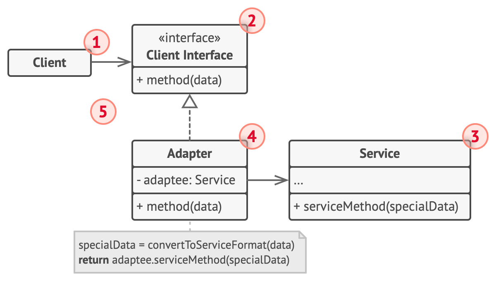

# 어댑터 패턴

어댑터는 서로 호환되지 않는 인터페이스를 가진 객체들이 협업할 수 있도록 하는 구조적 디자인 패턴이다.

어댑터는 변환의 복잡성을 캡슐화하기 위하여 객체중 하나를 래핑한다.

## 어댑터의 동작

- 어댑터는 기존에 있던 객체 중 하나와 호환되는 인터페이스를 받는다.
- 이 인터페이스를 사용하면 기존 객체는 어댑터의 메서드들을 안전하게 호출할 수 있다.
- 호출을 수신하면 어댑터는 이 요청을 두 번째 객체에 해당 객체가 예상하는 형식과 순서대로 전달한다.

## 구조

Java의 경우 다중 상속을 지원하지 않기 때문에 합성 방식으로 구현한다.

어댑터는 한 객체의 인터페이스를 구현하고 다른 객체는 래핑한다.

1. 클라이언트: 프로그램의 기존 비즈니스 로직
2. 클라이언트 인터페이스: 다른 클래스들이 클라이언트 코드와 상호작용하기 위해 따라야 프로토콜
3. 서비스: 일반적으로 레거시 코드. 클라이언트는 호환 문제로 서비스 클래스를 직접 사용하지 못한다.
4. 어댑터: 클라이언트와 서비스 양쪽에서 작동할 수 있는 클래스, 서비스 객체를 래핑하고 클라이언트 인터페이스를 구현한다. 어댑터는 어댑터 인터페이스를 통해 클라이언트로부터 호출들을 수신후, 호출을 래핑된 서비스 객체가 이해할 수 있는 형식의 호출들로 변환한다.
5. 클라이언트 코드는 어댑터를 사용하여 서비스 객체에 접근한다.

## 적용

- 기존에 있던 클래스를 사용하고 싶지만, 그 인터페이스가 나머지 코드와 호환되지 않을 때
- 부모 클래스에서 추가할 수 없는 공통 기능들이 없는 여러 기존 자식 클래스들을 재사용하려는 경우
  - 대상 클래스들에는 공통 인터페이스가 있어야하며 어댑터의 필드는 이 인터페이스를 구현해야한다.
  - 데코레이터 패턴과 유사하다.
